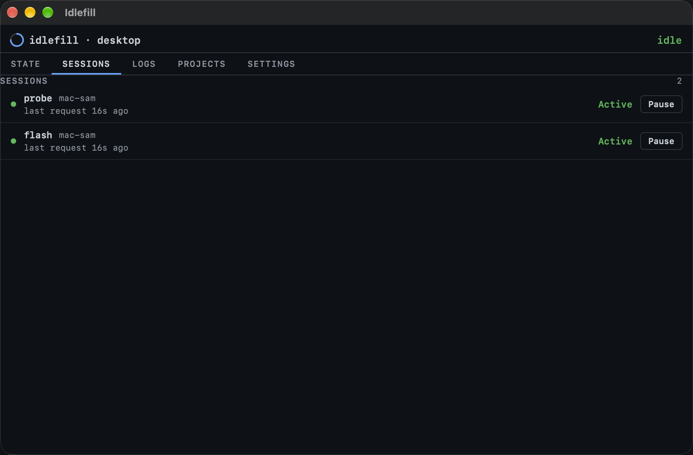
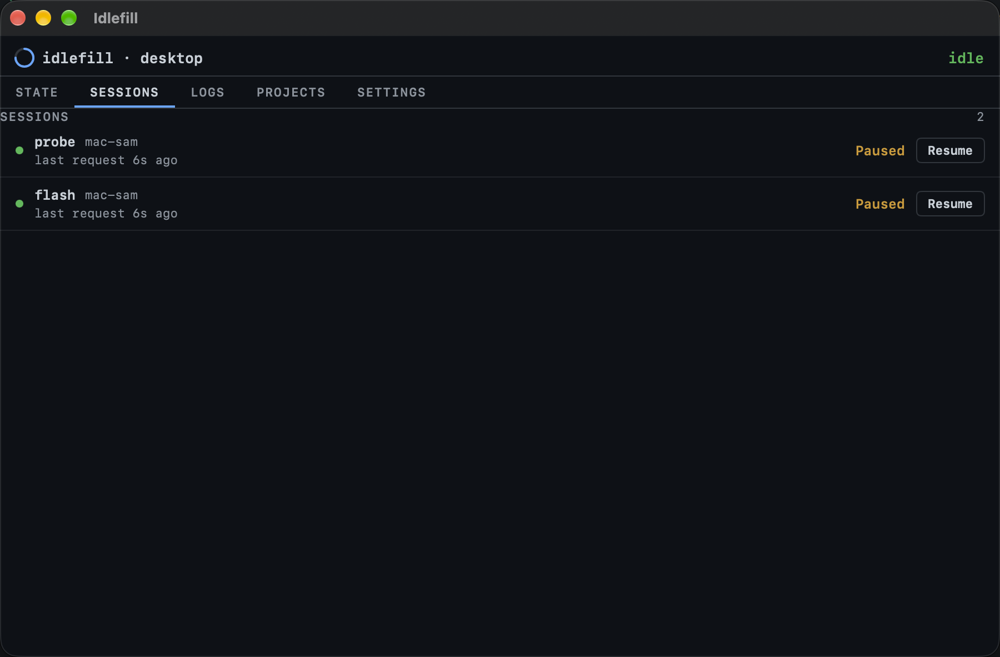

# Desktop Sessions tab — report

Branch: `desktop-sessions` (worktree `~/orca/workspaces/idlefill/desktop-sessions`).
Commits (this branch only — **no push, no merge to main**):

- `c42a2b0` desktop: sessions tab — the desktop becomes the interactive surface for Hermes sessions
- `9903319` desktop: sessions-test.sh — headless harness for the sessions tab
- `5cc5f80` docs: README — the desktop's sessions tab + its harness

## What was built

A fifth tab, **SESSIONS**, in the desktop window (tab order: state, sessions,
logs, projects, settings), making the desktop the interaction surface for the
Hermes sessions registered at the arbiter:

- **Data source:** the EXISTING `/api/state` 5s poll. `sessions[]` is parsed
  in `AppModel.apply()` through the pure `SessionsView.project` — no second
  fetch loop. Parsing runs before the clients guard (sessions are global
  interactive traffic; an empty `clients[]` payload still carries them).
- **Rows (dashboard-honest, mirrored from `server/public/index.html`
  `sessStateWord`/`sessBlock`):** state word `Paused` (override pause) >
  `Active` (online AND a request within 30s) > `Idle`; online =
  `now − last_seen < 90_000`; stale (heartbeat ≥90s) is a **dimmed row +
  "stale" tag**, never a state word; short token prefix as the label with the
  full token tooltip-only (`.help`); `client_name` when present; "last
  request …" age in the dashboard's `ago()` wording; `→ server_id` when set.
  ALL sessions are listed (the interaction surface needs healthy rows to
  pause them). Empty/absent `sessions[]` → a quiet mono/dim empty state,
  never a blank pane.
- **Interaction:** one gate button per row — `Pause` on a running row,
  `Resume` on a paused row — calling `POST <serverURL>/api/sessions/<urlencoded
  token>/override` with `{"override":"pause"}` / `{"override":null}` and
  `Authorization: Bearer <token>` from `AppModel.token()` (client/config.json,
  read at runtime). The arbiter's `onRequest` hook was verified to accept the
  Bearer header on this POST route (`server/src/api.ts` `bearer()` + hook —
  no `?token=` query needed). `force` is NOT exposed.
- **Write-path UX (the Settings/Projects pattern):** optimistic flip before
  the response; per-row in-flight disable (`pendingSessionTokens`, not
  global); revert + one-line error under the rows on failure; a 404
  (`unknown_session`) reverts, notes, and re-polls immediately so rows
  re-land on arbiter truth; success stands and the next 5s poll confirms.
- **Deep link:** `idlefill://sessions` → the new tab (unknown host still →
  State).
- **Pure projection + request builder:** `SessionsView.project(payload:nowMs:)`
  and `SessionsView.overrideRequest(serverURL:sessionToken:paused:arbiterToken:)`
  — the harness asserts both without networking for the pure parts.
  `AppModel.injectStatePayload` is the test seam (the menubar precedent).

## Decisions honored

1. Sessions tab after state; `sessions` deep-link host; unknown → State. ✔
2. Existing `/api/state` poll only; parsed in `apply()` alongside
   clients/leases. ✔
3. Dashboard row semantics kept honest (30s/90s windows, stale = tag + dim,
   tooltip token, all rows listed, quiet empty state). ✔
4. One Pause/Resume button per row; the exact override endpoint + body +
   Bearer header; token never baked in, printed, or displayed; no `force`. ✔
5. Optimistic + revert + per-row disable + 404 re-poll. ✔
6. Pure projection + `desktop/sessions-test.sh` following the
   `menubar/sessions-test.sh` pattern (real source minus `@main` + driver,
   `env -i`, JSON round-trip fixtures, canned payloads) proving (a)–(e) plus
   the real model write path against a local arbiter stub. ✔
7. `menubar/`, `server/`, `client/`, the dashboard untouched (`git show
   --stat` on the three commits touches only `desktop/IdlefillDesktop.swift`,
   `desktop/sessions-test.sh`, `README.md`). No server API changes, no extra
   tabs, no drive-by refactors. ✔

## Deviations

- **Optimistic Resume reads "Idle"** (not "Active"): the view row doesn't
  carry the row's own timestamps, so a resume optimistically shows Idle and
  the next ≤5s poll re-derives Active/Idle from arbiter truth. Pause flips
  to "Paused" exactly. Documented in code.
- **Harness stub tracks the override** (POST sets it, `/api/state` reflects
  it) so the app's background 5s poll can't race the write-path assertions;
  this mirrors arbiter behavior and makes the "paused row stands after the
  200" check deterministic.
- No central test-runner list exists to add the harness to: CI
  (`.gitea/workflows/test.yml`) only runs `swiftc -parse` on the desktop
  source; the Swift harnesses are documented per-section in the README —
  `desktop/sessions-test.sh` is now documented there next to the other
  harnesses.

## Harness output (`bash desktop/sessions-test.sh`)

57 PASS lines, both runs green:

```
==> run (env -i, the GUI environment; scratch repo -> the stub)
PASS (a) no sessions key: no rows
PASS (a) empty sessions[]: no rows
PASS (a) tokenless row dropped
PASS (b) 6 sessions projected
PASS (b) online + request 10s ago -> Active
PASS (b) online + request 31s ago -> Idle
PASS (b) online + no requests yet -> Idle
PASS (b) override pause -> Paused (beats Active)
PASS (b) 30s boundary: 29s ago still Active
PASS (b) offline (heartbeat 120s) + recent request -> NOT Active
PASS (b) 89s ago not stale / 91s ago stale
PASS (c) stale row keeps a REAL state word (Idle), stale flagged separately
PASS (c) paused + stale -> word Paused, stale tag still set
PASS (c) no row ever renders a 'Stale' state word
PASS (d) running row -> 'Pause'
PASS (d) paused row -> 'Resume'
PASS (d) stale running row -> 'Resume' would be wrong; it is 'Pause'
PASS (d) short token label + full token carried
PASS (d) client_name carried; empty treated as absent
PASS (d) last-request text uses the dashboard's ago() wording
PASS (d) server_id carried + 'last request 2m 12s ago'
PASS (e) pause URL = POST <server>/api/sessions/<token>/override
PASS (e) Authorization header carries the arbiter token
PASS (e) the arbiter token appears NOWHERE in the URL
PASS (e) content-type json
PASS (e) pause body {"override":"pause"}
PASS (e) resume body {"override":null} (NSNull on the wire)
PASS (e) session token percent-encoded in the path
PASS (f) init poll landed the stub row before the write cases
PASS (f) model.sessions populated by the real apply()
PASS (f) optimistic: row flips to Paused immediately
PASS (f) in-flight: the row's token is marked pending
PASS (f) in-flight disable is PER-ROW (the other row is not pending)
PASS (f) success: the paused row STANDS after the 200
PASS (f) success: no error note
PASS (f) in-flight flag cleared
PASS (f) the stub received POST /api/sessions/tokstub001/override
PASS (f) the stub saw the Bearer header with the config token
PASS (f) the stub saw content-type json
PASS (f) the stub saw body {"override":"pause"}
PASS (f) the arbiter token appears NOWHERE in any request path
PASS (f) resume: the stub saw body {"override":null}
PASS (f) resume: the row stands un-paused
PASS (f) 404: the ghost row reverted then VANISHED via the re-poll
PASS (f) 404: the one-line note names the arbiter-truth refresh
PASS (f) re-poll landed arbiter truth (fresh stub row, running)
PASS (g) idlefill://sessions routes to .sessions
PASS (g) unknown host still routes to .state
PASS (g) tab order state, sessions, logs, projects, settings
SESSIONS-DT-ALL-PASS
SESSIONS-DT-EXIT=0
==> run (dead port — the revert-on-failure contract)
PASS (f2) dead run: row projected
PASS (f2) optimistic flip lands before the response
PASS (f2) dead port: row REVERTED (not paused)
PASS (f2) dead port: the unreachable note is set
PASS (f2) in-flight flag cleared
SESSIONS-DT-DEAD-ALL-PASS
SESSIONS-DT-DEADPORT-EXIT=0
SESSIONS-DT-HARNESS-PASS
```

## Build output (`bash desktop/build.sh`)

Exit 0; the two swiftc warnings are PRE-EXISTING (edge-install code at
source lines ~894/923, untouched by this change):

```
==> swiftc -O (version 1.0, marker 1.0) → desktop/Idlefill.app/Contents/MacOS/Idlefill
==> bundling Sparkle.framework into Contents/Frameworks
==> writing desktop/Idlefill.app/Contents/Info.plist
==> codesign (ad-hoc) — LAST step, covers the bundled framework too
desktop/Idlefill.app: replacing existing signature
==> built desktop/Idlefill.app (version 1.0, marker 1.0, SUPublicEDKey absent)
```

## Regression gates

- `NODE_ENV= npm run test` — exit 0; all four workspaces report `fail 0`.
- `NODE_ENV= npm run build` — exit 0 (`idlefill-server` tsc clean).
- Nothing in `server/` / `client/` / `menubar/` changed (commit stats touch
  only `desktop/` + `README.md`).

## Live eyeball (freshly built app from THIS worktree)

Launched `desktop/Idlefill.app` (repo_path pointed at the worktree via the
app config for the session; the user's config was restored afterwards; the
pre-existing /Applications instance was quit and all instances exited
cleanly). The live arbiter at `http://100.105.225.1:8787` carried the two
registered sessions (`probe`, `flash`, both `mac-sam`).

1. Sessions tab opened: two rows, green dots, `probe`/`flash` + `mac-sam`,
   both **Active**, "last request 16s ago", **Pause** buttons.
2. Clicked **Pause** on `flash` → row flipped to **Paused** (amber) with a
   **Resume** button; arbiter truth via `GET /api/sessions` (Bearer read
   from client/config.json inside a script file, never printed):
   `prefix: flash | override: pause`. (An earlier click had also paused
   `probe` — both rows verified Paused in the screenshot, arbiter agreed.)
3. Clicked **Resume** on `flash` → row back to running; arbiter:
   `prefix: flash | override: None`. Then resumed `probe` too — final
   arbiter state: both sessions `override: None` (left exactly as found).

Screenshots (committed next to this report):

-  — the tab with both rows Active + Pause buttons
-  — both rows Paused (amber) + Resume buttons
-  — after resuming

## Left open

- Nothing named in the task remains. Per the standing rule: no push, no
  merge — the three commits wait on this branch for review.
